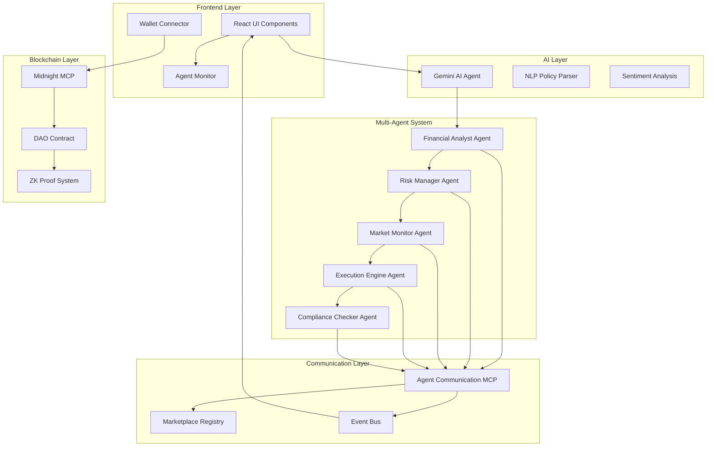

# AegisDAO - Autonomous AI Agent for DAO Treasury Management

<div align="center">


**Privacy-preserving • Multi-agent • ZK-powered**

</div>

## 🎯 Project Overview

AegisDAO is a cutting-edge decentralized autonomous organization (DAO) treasury management system powered by AI agents and privacy-preserving blockchain technology. The project leverages the Midnight blockchain's zero-knowledge capabilities, advanced AI through Google's Gemini 2.0 Flash, and a sophisticated multi-agent system to provide autonomous, intelligent, and private treasury management for DAOs.

## ✨ Key Features

### 🤖 **AI-Powered Treasury Management**
- **Autonomous Rebalancing**: AI agents continuously analyze portfolio performance and market conditions to suggest optimal rebalancing strategies
- **Risk Assessment**: Real-time risk analysis using advanced algorithms and market sentiment analysis
- **Natural Language Policy**: Define treasury policies in plain English, automatically converted to executable parameters

### 🔐 **Privacy-Preserving Operations**
- **Zero-Knowledge Transactions**: All treasury operations use ZK-proofs to maintain transaction privacy
- **Shielded Voting**: DAO governance votes are private while maintaining verifiability
- **Encrypted Agent Communications**: All inter-agent communications use end-to-end encryption

### 🌐 **Multi-Agent System**
- **Specialized Agents**: Each agent has specific capabilities (financial analysis, risk management, market monitoring, execution, compliance)
- **Autonomous Coordination**: Agents communicate and coordinate tasks without human intervention
- **Service Discovery**: Dynamic discovery and integration of external services through marketplace registry

### 🏛️ **DAO Governance**
- **Proposal System**: Create and vote on treasury management proposals
- **Shielded Voting**: Privacy-preserving governance using zero-knowledge proofs
- **Automated Execution**: Approved proposals automatically execute through smart contracts

## 🛠️ Technology Stack

### Frontend
- **React 18** with TypeScript
- **Vite** for fast development and building
- **Tailwind CSS** for responsive styling
- **shadcn/ui** for beautiful UI components
- **RainbowKit** for wallet connectivity

### AI & Machine Learning
- **Google Gemini 2.0 Flash** for advanced AI reasoning and analysis
- **Natural Language Processing** for policy interpretation
- **Sentiment Analysis** for market condition assessment

### Blockchain & Privacy
- **Midnight Network** for privacy-preserving smart contracts
- **Zero-Knowledge Proofs** for transaction privacy
- **Ethereum** for transparent operations where needed
- **Wagmi/Viem** for blockchain interactions

### Multi-Agent System
- **Model Context Protocol (MCP)** for agent communication standards
- **Eliza Framework** as base for autonomous agents
- **Supabase** for encrypted agent communication backend

## 🏗️ Architecture Overview



## 🤖 AI Agent Workflows

### 1. Financial Analyst Agent (`aegis_financial_analyst`)
**File**: `src/services/elizaBaseAgent.ts` (lines 280-320)

**Workflow**:
1. **Daily Portfolio Assessment**: Analyzes current portfolio allocation against risk parameters
2. **Market Research**: Gathers and processes market sentiment, volatility, and trend data
3. **Rebalancing Proposals**: Uses Gemini AI to generate optimized rebalancing strategies
4. **Risk Evaluation**: Assesses potential risks of proposed trades

**AI Integration**: Uses Gemini 2.0 Flash API for advanced financial analysis and decision-making

### 2. Risk Manager Agent (`sentinel_risk_manager`)
**File**: `src/services/agentCommunication.ts` (lines 150-200)

**Workflow**:
1. **Continuous Monitoring**: Tracks portfolio risk metrics in real-time
2. **Drawdown Protection**: Automatically triggers protective measures if losses exceed thresholds
3. **Position Sizing**: Calculates optimal position sizes based on risk tolerance
4. **Alert Generation**: Sends critical alerts when risk parameters are breached

### 3. Market Monitor Agent (`oracle_market_monitor`)
**File**: `src/services/agentCommunication.ts` (lines 150-200)

**Workflow**:
1. **Price Tracking**: Monitors asset prices across multiple exchanges
2. **Volatility Analysis**: Calculates and tracks market volatility indicators
3. **Sentiment Analysis**: Processes news and social media for market sentiment
4. **Anomaly Detection**: Identifies unusual market conditions or potential flash crashes

### 4. Execution Engine Agent (`nexus_execution_engine`)
**File**: `src/services/agentCommunication.ts` (lines 150-200)

**Workflow**:
1. **Trade Validation**: Verifies trade parameters and compliance requirements
2. **Optimal Execution**: Routes trades for best price and minimal slippage
3. **Transaction Privacy**: Implements zero-knowledge proofs for private transactions
4. **Settlement Monitoring**: Tracks transaction status and handles failures

### 5. Compliance Checker Agent (`guardian_compliance`)
**File**: `src/services/agentCommunication.ts` (lines 150-200)

**Workflow**:
1. **Regulatory Compliance**: Ensures all trades meet regulatory requirements
2. **Audit Trail**: Maintains detailed logs of all treasury operations
3. **Policy Enforcement**: Validates trades against DAO-defined policies
4. **Reporting**: Generates compliance reports for governance review

## 📁 File Structure & Code Organization

### Core Services

#### 🧠 AI & Analysis
- **`src/services/geminiService.ts`** (260 lines): Gemini AI integration for financial analysis, trade evaluation, and policy interpretation
- **`src/services/elizaBaseAgent.ts`** (400+ lines): Base agent framework with task management, decision-making, and autonomous operation capabilities

#### 🔐 Blockchain & Privacy
- **`src/services/midnightMCP.ts`** (200+ lines): Midnight blockchain integration with wallet management, shielded transactions, and ZK-proof generation
- **`src/services/daoContract.ts`** (200+ lines): DAO governance contract with proposal creation, shielded voting, and treasury operations

#### 🌐 Multi-Agent System
- **`src/services/agentCommunication.ts`** (300+ lines): Agent-to-agent communication with encryption, service discovery, and message routing
- **`src/services/marketplaceRegistry.ts`** (250+ lines): Decentralized service registry for agent capability discovery and reputation management
- **`src/services/agentBus.ts`** (20 lines): Event bus for system-wide agent communication and monitoring

### Frontend Components

#### 📊 Dashboard & Management
- **`src/components/AegisDashboard.tsx`**: Main dashboard integrating all system components
- **`src/components/TreasuryOverview.tsx`**: Real-time treasury balance and performance metrics
- **`src/components/RiskPolicyManager.tsx`**: Natural language policy definition and management

#### 🤖 AI Interfaces
- **`src/components/AIRebalancingProposal.tsx`**: AI-generated rebalancing proposal display and approval
- **`src/components/AIChat.tsx`**: Direct chat interface with AI agents for trade analysis
- **`src/components/AgentMonitor.tsx`**: Real-time multi-agent system monitoring and control

#### 🔗 Connectivity
- **`src/components/WalletConnector.tsx`**: Web3 wallet integration with RainbowKit
- **`src/providers/RainbowKitProvider.tsx`**: Blockchain connectivity provider

## 🎮 How It Works

### 1. **Wallet Connection & Initialization**
Users connect their Web3 wallet through RainbowKit integration. The system initializes the Midnight MCP wallet for privacy-preserving operations and registers with the multi-agent system.

### 2. **Policy Definition**
Users define treasury management policies in natural language (e.g., "I want a conservative policy focused on 60% stablecoin yield and low volatility"). The AI interprets these policies into executable parameters.

### 3. **Autonomous Analysis Cycle**
The multi-agent system continuously runs analysis cycles:
- **Market Monitor** gathers current market data and sentiment
- **Financial Analyst** analyzes portfolio performance and generates rebalancing proposals
- **Risk Manager** validates proposals against risk parameters
- **Compliance Checker** ensures regulatory compliance
- **Execution Engine** prepares for trade execution

### 4. **Proposal Generation & Voting**
AI-generated proposals are presented to DAO members for voting. Votes are cast using zero-knowledge proofs to maintain privacy while ensuring verifiability.

### 5. **Automated Execution**
Approved proposals are automatically executed through the Execution Engine, using shielded transactions on the Midnight network to maintain privacy.

### 6. **Continuous Monitoring**
The system continuously monitors portfolio performance, market conditions, and risk metrics, adjusting strategies as needed.

## 🔍 Multi-Agent System Monitor Workflow

The Multi-Agent System Monitor provides real-time visibility into the autonomous agent network:

### Backend Workflow (Agent Communication)
1. **Agent Registration**: Each agent registers with the communication system, advertising capabilities and endpoints
2. **Service Discovery**: Agents discover available services through the marketplace registry
3. **Task Assignment**: The orchestrator assigns tasks based on agent capabilities and current workload
4. **Inter-Agent Messaging**: Agents communicate using encrypted messages through the communication layer
5. **Status Monitoring**: Continuous heartbeat monitoring ensures agent availability
6. **Result Aggregation**: Task results are collected and processed for decision-making

### Frontend Visualization
- **Real-time Agent Status**: Live display of each agent's current status (online, busy, offline)
- **Communication Log**: Stream of inter-agent messages and coordination activities  
- **Task Progress**: Visual representation of ongoing tasks and their completion status
- **System Health**: Overall system status and performance metrics
- **Emergency Controls**: Manual intervention capabilities for critical situations

## 🎯 Use Cases

### 1. **Automated Portfolio Rebalancing**
- **Scenario**: Market conditions change, requiring portfolio adjustment
- **Process**: Market Monitor detects changes → Financial Analyst generates proposal → Risk Manager validates → DAO votes → Execution Engine implements
- **Privacy**: All transactions use ZK-proofs, maintaining confidentiality

### 2. **Risk Management**
- **Scenario**: Portfolio exceeds risk thresholds
- **Process**: Risk Manager triggers alert → Emergency protocols activate → Protective trades execute automatically
- **Speed**: Autonomous execution within seconds of risk detection

### 3. **Governance Optimization**
- **Scenario**: Multiple competing proposals for treasury allocation
- **Process**: AI analyzes proposals → Provides recommendations → DAO members vote privately → Results execute automatically
- **Transparency**: Public voting results with private individual votes

### 4. **Market Opportunity Capture**
- **Scenario**: Sudden arbitrage or yield farming opportunity appears
- **Process**: Market Monitor detects opportunity → Financial Analyst evaluates → System executes within risk parameters
- **Efficiency**: Millisecond response times through agent coordination

## 🔧 Development & Deployment

### Prerequisites
- Node.js 18+ with npm/yarn
- Web3 wallet (MetaMask, WalletConnect compatible)
- Gemini API key for AI functionality

### Setup Instructions
```bash
# Clone the repository
git clone <repository-url>
cd aegis-dao

# Install dependencies
npm install

# Start development server
npm run dev
```

### Environment Configuration
The project uses the Gemini API with the key embedded in the codebase for demonstration purposes. In production, API keys should be managed through Lovable's secrets management system.

### Building for Production
```bash
# Build for production
npm run build

# Preview production build
npm run preview
```

## 🚀 Future Enhancements

### Planned Features
- **Advanced AI Models**: Integration with multiple AI providers for enhanced analysis
- **Cross-chain Operations**: Support for multiple blockchain networks
- **Enhanced Privacy**: Additional zero-knowledge proof implementations
- **Regulatory Compliance**: Built-in compliance frameworks for different jurisdictions
- **Mobile Interface**: Native mobile app for DAO management

### Extensibility
The modular architecture allows for easy extension:
- **New Agent Types**: Add specialized agents for specific functions
- **Custom Strategies**: Implement domain-specific trading strategies
- **External Integrations**: Connect to additional DeFi protocols and services
- **Enhanced Privacy**: Implement additional privacy-preserving technologies

## 🤝 Contributing

This project represents a demonstration of advanced DAO treasury management using AI and privacy-preserving technologies. The codebase is designed to be educational and extensible, showcasing best practices in:

- Multi-agent system architecture
- AI integration in financial applications
- Zero-knowledge proof implementation
- Decentralized governance systems

## 📄 License

This project is built for educational and demonstration purposes, showcasing the integration of advanced AI, blockchain, and privacy technologies in DAO treasury management.

---

<div align="center">
<strong>AegisDAO - Where AI Meets Privacy-Preserving Finance</strong>
</div>